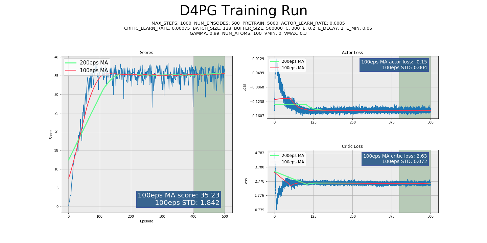
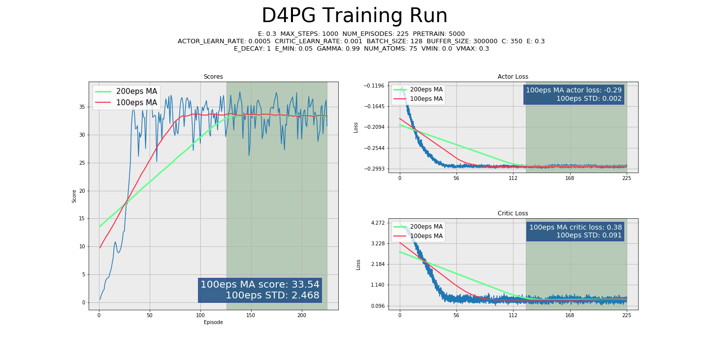
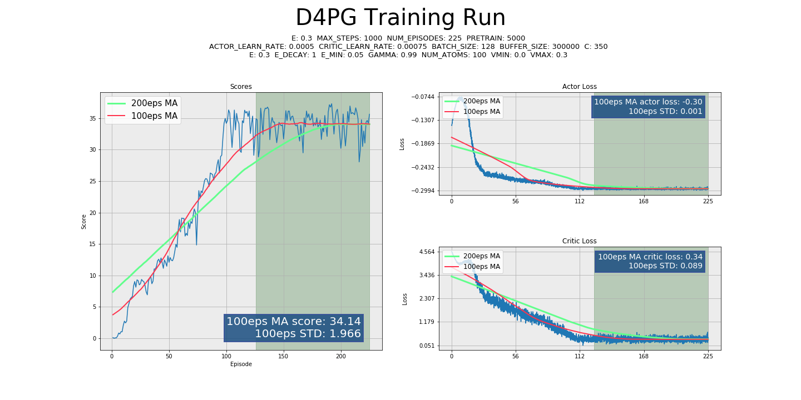
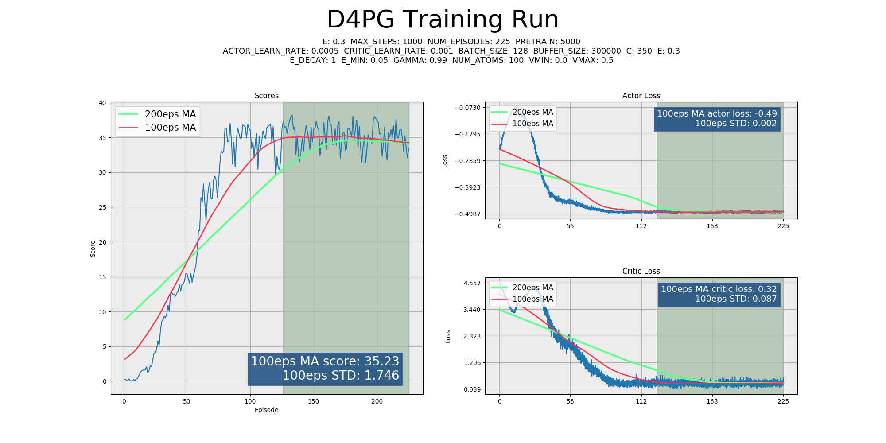

# **CONTINUOUS CONTROL** - Reacher

### *Implementation for Udacity Deep Reinforcement Learning*
***

##### Load a few extensions before doing anything else...


```python
%load_ext autoreload
%autoreload 2
```


```python
from utils import *
```

# Project Overview, Results, & To-Do

### Agent overview

#### This codebase implements a [**Distributed Distributional Deep Deterministic Policy Gradient (D4PG)**](https://arxiv.org/pdf/1804.08617.pdf) agent based upon the groundbreaking work by Google DeepMind.


D4PG is itself an evolution out of the paper [_"Continuous Control with Deep Reinforcement Learning (DDPG)"_](https://arxiv.org/pdf/1509.02971.pdf), also groundbreaking, also by Google DeepMind.


DDPG is an architecture which allows for an **Actor** network to estimate a deterministic action policy while determining the _value_ of that action using a **Critic** network that outputs a Q-value by using the Action as part of the input.

The paper introducing D4PG introduces several key improvements over the algorithm described in the original DDPG paper:
* K-Actor distributed training
* Prioritized Replay buffer
* N-Step Rollout/Bootstrapping
* **Distributional Value Estimation**

In my opinion, the most important addition here is the _Distributional_ step. The other steps have been studied and/or implemented in other papers or textbooks, and feel more evolutionary to the DDPG algorithm than a truly new algorithm.

_**Distributional Value Estimation**_ allows the agent to not just estimate the value of a given action, but to estimate the probability of a value, thus allowing for uncertainty in the return. I certainly feel, and agree with the research that posits the idea, that allowing an agent to say "This is X% likely to result in this value, but also Y% in this other value" is much more like how a human, or intelligent creature, learns. At the very least it adds robustness to training by allowing for further complexity in comparing online and offline network estimations and thus improves loss calculations.

This portion of the research is credited to:  
[_"A Distributional Perspective on Reinforcement Learning"_](https://arxiv.org/pdf/1707.06887.pdf)  
And should be considered a must-read for anyone interested in the concept.

_**Categorial Projection**_ is key to the implementation of the distributional portion of this algorithm and ensures that the discretization of the target and local rewards correlate in a mathematically correct manner. The math here requires further study, but the papers above and certain repositories credited in the code were helpful in implementing the methodology.

The D4PG paper suggested that **Prioritized Experience Replay (PER)** did not result in demonstrable improvements in training, and thus, it was not implemented here. The results achieved by this agent do not seem to suffer for it's lack, but it would be good to test with and without to be thorough in evaluating training performance.

This agent does use **N-Step Bootstrapping** as described in the paper. N-Step bootstrapping performs Temporal-Difference (TD) Learning across N steps instead of a single SARS' tuple. In a plentiful-reward environment such as _Reacher_, removing uncertainty from value estimation is a huge win, and while I did not run trials of differing values for `N`, it is likely that larger values would have some positive effect, similarly to a PPO agent.


### Because who doesn't like to see the results before the details...

Notice that in the second graph, the environment was solved in approximately 125 episodes! 

None of these agents had early-termination procedures, so the 100-episode average is simply the final 100 episodes, not the point at which they technically solve the task.

It should be noted that while the agent can technically _solve_ the environment rapidly, there **is** benefit to running extra episodes to achieve greater stability. The weights included with this repository are associated with the first graph, which was trained for 500 episodes, or approximately 350+ additional episodes after _solving_ the environment. It performs more reliably in evaluation mode than some other saved weights that, while technically achieving the target score, sometimes display erratic behavior that didn't have a chance to be swatted out with additional training.






### Hyper Parameters


The D4PG algorithm is robust to a very wide variety of hyperparameters, below are a few examples.

In all of the above examples, the learning rate varied considerably, and the `vmax` parameter was also robust to change. Many tests were run of differing `C` rates, Learning Rates, Pretrain amounts, and values for ATOMS/VMIN/VMAX, and while there was variation in speed and stability, the agent consistently solved the environment in less than 225 episodes. 

* **`ACTOR_LEARN_RATE / CRITIC_LEARN_RATE`** - Tests were run, with good results, of values of 0.01-0.00005 for both values, generally ending with very robust results regardless. The sweet spot is around 0.0005 for the **actor**, and 0.001 for the **critic**. The Actor network should _always_ learn at a slower rate than the Critic, for stability. It would be a good goal for future work to test this out in a rigorous way, but all networks created for this class have thus far performed best when Actor is 50-75% of the Critic learning rate.

* **`C/TAU`** - I have consistently, across all projects, found that a HARD update type utilizing a parameter C controlling how many timesteps between updates, gives me superior performance over soft-update style gradual target network updating using parameter TAU. In the training for this agent, C is consistently set around 350. Tests were run with significantly higher values, thereby updating the network considerably less often, however, they performed poorly or not at all. It is my belief that because this environment collects 20 experiences per timestep, that hard updating the network more frequently is successful, due to the huge amount of experience rapidly collected about the current policy.

* **`EPSILON`** - Very interestingly, this agent was solved and perfected _without_ annealing Epsilon at all! This agent is robust enough that it can achieve very high scores even while having gaussian noise added to it's action output. Upon removing the noise for evaluation, the agent generally moves human-smoothly and perfects the environment.

* **`PRETRAIN`** - The _Reacher_ environment achieved much better performance with at least several thousand pretraining steps performed before learning. Filling the buffer can be extremely fast, as there is no need to run either the Actor network, or any backpropogation. Random actions suffice to provide learnable experience.

* **`ROLLOUT`** - As stated above, n-step rollout was allowed to run in this environment, but was inconsequential to the results. This parameter could be set to 1 and achieve the same scores. Theoretically, having a rollout contribution should stabilize learning, but there was not computing bandwidth to run trials of this.

* **`L2_DECAY`** - Adding a very small Adam Optimizer l2 decay seemed to be a benefit, this parameter was never tuned in a meaningful way.

* **`ATOMS`** - Atoms/Num_Atoms controls the granularity with which the probability distribution is estimated from the Q-network. More Atoms equals a finer-grained discretization of the curve. Note that _**more atoms does not equal better performance**_. The D4PG paper suggested that 51 atoms was a sweet spot for their tasks, while I found 75-101 atoms to be more efficacious in this task, for whatever reason. More than 101 atoms negatively affected performance. There is likely further research to be done, or read up upon if someone has already performed it, on the relationship between action complexity, reward density, and the number of `atoms` which is effective.

* **`VMIN / VMAX`** - _vmin_ and _vmax_ are the bounds on the values predicted by the Agent. The `atoms` are distributed between these two values, which are in turn multiplied by the probabilities from the Critic network to arrive at the value distribution. Because there are no negative rewards in this environment, the value for `vmin` must necessarily be set to 0, the lowest value of any state/action. The value for `vmax` is  more ephemeral... the maximum value for a timestep is 0.1, however, the value function estimates _total return_, and due to the categorical projection step, the current _real rewards_ are added to the value distribution estimation, and bounded by `vmax` as well. Thus, an argument could be made that `vmax` should be set to the theoretical maximum episode score (perhaps 40) for the environment. However, experimentally, the agent performed best when `vmax` was set between 0.3 and 0.5. **0.5** is the same value as the number of rollout steps implemented multiplied by the per-step reward maximum... it is possible there is a relationship between the n-step bootstrapping and the ideal value for the `vmax` parameter. This would need to be further researched in a more rigorous way in additional settings.


### Future Ideas

* **Categorical Projection** is the step by which the target values are projected onto the supports defined by the local value function. The math and concepts here stretched the limits of my knowledge, and while I grasp the concepts, I would very much like to achieve a deeper understanding of the mathematical principals and implementation.
* [**Prioritized Experience Replay (PER)**](https://arxiv.org/abs/1511.05952) was implemented in my DQN agent, but never fully tested. I believe that for complex tasks like this _Reacher_ environment, or perhaps moreso to the optional _Crawler_ environment, utilizing PER could provide measurable speedup in learning rate. 
* As explored above in the hyperparameter section, the relationship between `VMIN/VMAX` and the environment rewards merits further study and understanding.
* The relationship between action complexity and `atoms` also merits further understanding.
* I implemented a D4PG agent as opposed to the base DDPG algorithm because it was newer, presented more challenges, and had less (to none) GitHub examples available, especially in PyTorch. It was well worth the effort required to read, understand, and implement the algorithm. However, it would be good to compare performance with DDPG itself! While D4PG seems to achieve superior results to the instructor provided benchmarks, and learns very quickly and stably in this environment, the extent to which it is or is not superior to DDPG is unclear without a direct comparison to trial.
* **PPO/TRPO algorithms** would be good to implement as further comparisons and to add to my tool chest. While I understand Policy Based methods, there is no substitute for _doing_, and to round out my knowledge of the current state-of-the-art, having hands-on experience with these methods would be beneficial.
* I believe D4PG has a wide variety of applications to other tasks, especially difficult tasks for which brute-force policy methods might fail. I look forward to running this agent in as many environments as time permits.
* **Parameter Noise** is a process by which noise is added to the network weights instead of as a constant applied to the network output. OpenAI has pioneered this process with their paper [_Parameter Space Noise for Exploration_](https://arxiv.org/abs/1706.01905). While this agent quickly converges to an optimal policy in the current implementation, it would be worthwhile to explore parameter noise, as it may be more relevant to more complex tasks such as locomotion.

## Click below to watch the trained Agent!
[](https://youtu.be/d-r1OjuTpaI "Reacher")

# Implementation Details

## Initialize Imports
This Notebook uses code from separate python files where most of the implementation is handled


```python
import numpy as np
from agent import D4PG_Agent
from environment import Environment
from data_handling import Logger, Saver, gather_args
```

## Implement **`MAIN.PY`**
####  _This implementation was originally intended to be run on the command-line, so we'll need to import the functions from **`main.py`** and explore._

### Simulate a command line **`Args`**
Commandline arguments run the entire show, we'll have to simulate a command line entry.


```python
cmd_args = "--num_episodes 200 --actor_learn_rate 0.0005 --critic_learn_rate 0.001 --C 350 --vmin 0 --vmax 0.3"
```


```python
args = gather_args(cmd_args.split())
```

Let's check out what arguments have been loaded...


```python
print_args(args)
```

    actor_learn_rate: 0.0005
    critic_learn_rate: 0.001
    batch_size: 128
    buffer_size: 300000
    C: 350
    layer_sizes: [400, 300]
    cpu: False
    e: 0.3
    vmin: 0.0
    vmax: 0.3
    num_atoms: 100
    eval: False
    force_eval: False
    gamma: 0.99
    max_steps: 1000
    nographics: False
    num_episodes: 200
    pretrain: 5000
    quiet: False
    resume: False
    rollout: 5
    save_every: 10
    log_every: 50
    print_every: 3
    tau: 0.0005
    latest: False
    filename: None
    save_dir: saves
    device: cuda:0
    load_file: False
    

### Set up the **`Environment`**
Now that args are loaded, we can load the environment.


```python
env = Environment(args)
```

    LOADING ON SYSTEM: Windows
    ##################################################
    #                                                #
    

    INFO:unityagents:
    'Academy' started successfully!
    Unity Academy name: Academy
            Number of Brains: 1
            Number of External Brains : 1
            Lesson number : 0
            Reset Parameters :
    		goal_speed -> 1.0
    		goal_size -> 5.0
    Unity brain name: ReacherBrain
            Number of Visual Observations (per agent): 0
            Vector Observation space type: continuous
            Vector Observation space size (per agent): 33
            Number of stacked Vector Observation: 1
            Vector Action space type: continuous
            Vector Action space size (per agent): 4
            Vector Action descriptions: , , , 
    

    #                                                #
    ##################################################
    

Print some information about the environment.


```python
print("Num Agents:", env.agent_count)
print("Action size:", env.action_size)
print("State size:", env.state_size)
```

    Num Agents: 20
    Action size: 4
    State size: 33
    

#### Take random actions in the Environment
* Check that the environment is working
* Test commands and see the results!

While testing out the environment, set training mode to False, and limit max_steps to ensure it doesn't run too long for testing purposes.

Keep in mind that for this environment, all tensors are stacked 20-high! One for each Arm in the environment.


```python
env.train = False
env.reset()
num_eps = 1
state = env.states
env.reset()
for _ in range(50):
    score = np.zeros(env.agent_count)
    actions = np.random.uniform(-1, 1, (env.agent_count, env.action_size))
    next_state, reward, done = env.step(actions)
    state = next_state
```


```python
print_env_info(state[0], actions[0], reward[0])
```

    The agent chooses ACTIONS that look like:
    [ 0.03457177  0.19341014 -0.8588225   0.48567791]
    
    The environment returns STATES that look like:
    tensor([ 4.4230e-01, -3.9349e+00, -5.7129e-01,  9.9591e-01,  5.4950e-02,
             3.9405e-03, -7.1558e-02, -1.1179e-01,  9.1464e-02, -6.2235e-01,
            -2.5099e+00, -3.7132e-01,  3.9625e-01,  1.4842e+00, -8.9285e+00,
             1.0846e+00, -4.7750e-03, -3.7889e-01, -9.1661e-01,  1.2743e-01,
            -9.2281e-01,  1.2188e+00,  6.4121e-01,  1.3334e+00,  2.7787e+00,
             2.4045e+00,  3.2184e+00, -1.0000e+00, -7.3241e+00,  0.0000e+00,
             1.0000e+00,  0.0000e+00,  3.9281e-02])
    
    The environment returns REWARDS that look like:
    0.0
    

## Evaluate a trained Agent

Let's see a trained agent in action! 

Preview in this notebook using:


```python
notebook_eval_agent(args, env, "weights/D4PG_v1.agent", num_eps=3)
```

    ##################################################
    #                                                #
     Successfully loaded file: weights/D4PG_v1.agent  
    #                                                #
    ##################################################
    Score: 38.03999914973974
    Score: 37.82849915446714
    Score: 37.47449916237965
    

**Or on the commandline, run the following command:**  
**`python main.py -eval -savedir weights`**  
*If you wish to see more than two episodes of evaluation, try this:*  
**`python main.py --force_eval -num 5 -savedir weights`**  

You will be prompted to load a file on the command line.

Note that the Agent weights require the same network setup for loading as when they were training, this affects `layer_sizes` and `num_atoms`. If you receive a mismatch error, be sure to explicitly flag the correct parameters from the command line. You can determine the correct values easily from the error. The saved weights provided in this repository match the default values for command line parameters.

## Training
Now that the initial setup is created, training is as simple as running the **`train()`** routine. We'll take a look inside each step below.

For Notebook purposes, saving has been disabled. Closing the environment is also disabled because the environment errors if closed and reopened in the Notebook.

### Load the **`Agent`** and **`Saver`** objects
* The D4PG_Agent object sets up the networks and parameters for the Agent to run.
* The Saver object will select a savename based on the framework, current time, and version-up if necessary. No files or folders are created until there is a file to write.


```python
# Using the params from args and the environment, set up an agent for training
agent = D4PG_Agent(env, args)

# The Saver object will do all the saving and loading for the Agent
saver = Saver(agent.framework, agent, args.save_dir, args.load_file)
```

    ##################################################
    #                                                #
       Saving to base filename: D4PG_20190403_v002    
    #                                                #
    ##################################################
    


```python
def train(agent, args, env, saver):
    """
    Train the agent.
    """

    logger = Logger(agent, args, saver.save_dir)

    # Pre-fill the Replay Buffer
    agent.initialize_memory(args.pretrain, env)

    #Begin training loop
    for episode in range(1, args.num_episodes+1):
        # Begin each episode with a clean environment
        env.reset()
        # Get initial state
        states = env.states
        # Gather experience until done or max_steps is reached
        for t in range(args.max_steps):
            actions = agent.act(states)
            next_states, rewards, dones = env.step(actions)
            agent.step(states, actions, rewards, next_states)
            states = next_states

            logger.log(rewards, agent)
            if np.any(dones):
                break

        #saver.save_checkpoint(agent, args.save_every)
        agent.new_episode()
        logger.step(episode, agent)

    #env.close()
    #saver.save_final(agent)
    #logger.graph()
    return
```

### *Reviewing each step*

#### Create **`Logger`** object
**`logger = Logger(agent, args, saver.save_dir)`**


* Logger:
    * prints status updates
    * keeps track of rewards
    * writes log files to disk
    * creates a graph for review at the end of training
    
#### Initialize memory
**`agent.initialize_memory(args.pretrain, env)`**

* Learning cannot begin until the ReplayBuffer has at least as many memories as batch_size
* In many cases, training is improved by collecting many random memories before learning from any given experience  
    * _**`args.pretrain`**_ will fill the memory with however many random experience tuples as desired, usually in the thousands, although it was found during training that sometimes, setting this too high, reduces or eliminates convergence!
    
#### Training loop

```python
#Begin training loop
for episode in range(1, args.num_episodes+1):
    # Begin each episode with a clean environment
    env.reset()
    # Get initial state
    states = env.states
    # Gather experience until done or max_steps is reached
    for t in range(args.max_steps):
        actions = agent.act(states)
        next_states, rewards, dones = env.step(actions)
        agent.step(states, actions, rewards, next_states)
        states = next_states

        logger.log(rewards, agent)
        if np.any(dones):
            break
```

* Training will proceed for a specified number of episodes, in this code there is no implementation of early termination upon goal achievement.
* Perform a standard Reinforcement Agent training loop:
    * Get the initial state
    * Select an action
    * Collect next state, reward, and done-status from the environment after taking a step with the selected action
    * Store the experience tuple of S, A, R, S'
    * Rinse, wash, repeat
* Inside of _**`agent.step`**_, the current experience is stored as a memory, and learning is then performed. This will be reviewed later in the AGENT review section. Experiences are stacked for NStep-Bootstrapping, but all that magic happens in the Agent, and not muddying up the training loop.
* Log the rewards for the current timestep.
* If a terminal state is reached, start a new episode!

#### Post Episode

**`saver.save_checkpoint(agent, args.save_every)`**  
At the end of each episode, the agent saves checkpoint weights every so often, as defined by the commandline arguments.

**`agent.new_episode()`**  
The agent then resets.

**`logger.step(episode, agent)`**  
Logger keeps track of the scores, and prints status updates each `print_every` episodes.

#### Post Training

**`env.close()`**
Close the environment.

**`saver.save_final(agent)`**
Save a final weights file.

**`logger.graph()`**
Create a graph from the Log data created during training.

### What a training loop looks like in practice


```python
#To run a quick test, limit the length of training
args.num_episodes = 2
args.print_every = 1
env.train = True
args.eval = False
```


```python
train(agent, args, env, saver)
```

    ##################################################
    #                                                #
              Starting training at: 02:16:48          
    #                                                #
    ##################################################
    ##################################################
    #                                                #
                 actor_learn_rate: 0.0005             
                 critic_learn_rate: 0.001             
                     batch_size: 128                  
                   buffer_size: 300000                
                          C: 350                      
                 layer_sizes: [400, 300]              
                        cpu: False                    
                          e: 0.3                      
                        vmin: 0.0                     
                        vmax: 0.3                     
                      num_atoms: 100                  
                        eval: True                    
                    force_eval: False                 
                       gamma: 0.99                    
                     max_steps: 1000                  
                     num_episodes: 2                  
                      pretrain: 5000                  
                      resume: False                   
                        rollout: 5                    
                      log_every: 50                   
                      filename: None                  
                     save_dir: saves                  
                      device: cuda:0                  
                     load_file: False                 
                     framework: D4PG                  
                     agent_count: 20                  
                      action_size: 4                  
                      state_size: 33                  
                        e_decay: 1                    
                       e_min: 0.05                    
                    update_type: hard                 
    atoms: tensor([0.0000, 0.0030, 0.0061, 0.0091, 0.0121, 0.0152, 0.0182, 0.0212, 0.0242,
            0.0273, 0.0303, 0.0333, 0.0364, 0.0394, 0.0424, 0.0455, 0.0485, 0.0515,
            0.0545, 0.0576, 0.0606, 0.0636, 0.0667, 0.0697, 0.0727, 0.0758, 0.0788,
            0.0818, 0.0848, 0.0879, 0.0909, 0.0939, 0.0970, 0.1000, 0.1030, 0.1061,
            0.1091, 0.1121, 0.1152, 0.1182, 0.1212, 0.1242, 0.1273, 0.1303, 0.1333,
            0.1364, 0.1394, 0.1424, 0.1455, 0.1485, 0.1515, 0.1545, 0.1576, 0.1606,
            0.1636, 0.1667, 0.1697, 0.1727, 0.1758, 0.1788, 0.1818, 0.1848, 0.1879,
            0.1909, 0.1939, 0.1970, 0.2000, 0.2030, 0.2061, 0.2091, 0.2121, 0.2152,
            0.2182, 0.2212, 0.2242, 0.2273, 0.2303, 0.2333, 0.2364, 0.2394, 0.2424,
            0.2455, 0.2485, 0.2515, 0.2545, 0.2576, 0.2606, 0.2636, 0.2667, 0.2697,
            0.2727, 0.2758, 0.2788, 0.2818, 0.2848, 0.2879, 0.2909, 0.2939, 0.2970,
            0.3000], device='cuda:0')
    memory: <buffers.ReplayBuffer object at 0x000002A9CE043CC0>
    actor: ActorNet(
      (fc1): Linear(in_features=33, out_features=400, bias=True)
      (fc2): Linear(in_features=400, out_features=300, bias=True)
      (output): Linear(in_features=300, out_features=4, bias=True)
    )
    actor_target: ActorNet(
      (fc1): Linear(in_features=33, out_features=400, bias=True)
      (fc2): Linear(in_features=400, out_features=300, bias=True)
      (output): Linear(in_features=300, out_features=4, bias=True)
    )
    actor_optim: Adam (
    Parameter Group 0
        amsgrad: False
        betas: (0.9, 0.999)
        eps: 1e-08
        lr: 0.0005
        weight_decay: 0.0001
    )
    critic: CriticNet(
      (fc1): Linear(in_features=33, out_features=400, bias=True)
      (fc2): Linear(in_features=404, out_features=300, bias=True)
      (output): Linear(in_features=300, out_features=100, bias=True)
    )
    critic_target: CriticNet(
      (fc1): Linear(in_features=33, out_features=400, bias=True)
      (fc2): Linear(in_features=404, out_features=300, bias=True)
      (output): Linear(in_features=300, out_features=100, bias=True)
    )
    critic_optim: Adam (
    Parameter Group 0
        amsgrad: False
        betas: (0.9, 0.999)
        eps: 1e-08
        lr: 0.001
        weight_decay: 0.0001
    )
    #                                                #
    ##################################################
    ##################################################
    #                                                #
     Logfiles saved to: saves/D4PG_20190403_v002/logs 
              ...D4PG_20190403_v002_LOG.txt           
           ...D4PG_20190403_v002_actorloss.txt        
           ...D4PG_20190403_v002_criticloss.txt       
             ...D4PG_20190403_v002_scores.txt         
    #                                                #
    ##################################################
    Initializing memory buffer.
    Taking pretrain step 10... memory filled: 120/5000                    
    Taking pretrain step 20... memory filled: 320/5000                    
    Taking pretrain step 30... memory filled: 520/5000                    
    Taking pretrain step 40... memory filled: 720/5000                    
    Taking pretrain step 50... memory filled: 920/5000                    
    Taking pretrain step 60... memory filled: 1120/5000                    
    Taking pretrain step 70... memory filled: 1320/5000                    
    Taking pretrain step 80... memory filled: 1520/5000                    
    Taking pretrain step 90... memory filled: 1720/5000                    
    Taking pretrain step 100... memory filled: 1920/5000                    
    Taking pretrain step 110... memory filled: 2120/5000                    
    Taking pretrain step 120... memory filled: 2320/5000                    
    Taking pretrain step 130... memory filled: 2520/5000                    
    Taking pretrain step 140... memory filled: 2720/5000                    
    Taking pretrain step 150... memory filled: 2920/5000                    
    Taking pretrain step 160... memory filled: 3120/5000                    
    Taking pretrain step 170... memory filled: 3320/5000                    
    Taking pretrain step 180... memory filled: 3520/5000                    
    Taking pretrain step 190... memory filled: 3720/5000                    
    Taking pretrain step 200... memory filled: 3920/5000                    
    Taking pretrain step 210... memory filled: 4120/5000                    
    Taking pretrain step 220... memory filled: 4320/5000                    
    Taking pretrain step 230... memory filled: 4520/5000                    
    Taking pretrain step 240... memory filled: 4720/5000                    
    Taking pretrain step 250... memory filled: 4920/5000                    
    Taking pretrain step 254... memory filled: 5000/5000                    
    Done!
    
    Ep: 1/2 - 1000 steps - @02:18:08
    Batch: 1m20s, Total: 1m20s, Est.Remain: 1m20s
    ...Actor Loss: -0.1497, Critic Loss: 4.2852                  
    Avg RETURN over previous 1 episodes: 0.3525
    
    
    Ep: 2/2 - 2000 steps - @02:19:16
    Batch: 1m8s, Total: 2m28s, Est.Remain: 0s
    ...Actor Loss: -0.1565, Critic Loss: 4.1183                  
    Avg RETURN over previous 1 episodes: 0.2565
    
    


```python
# Close the environment
env.close()
```

## The Model

Before getting into the Agent, let's quickly review the Neural Network model, which is quite straightforward but adds a small twist in order to esimate the continuous action space!

```python
WEIGHT_LOW = -3e-2
WEIGHT_HIGH = 3e-2

def initialize_weights(net, low, high):
    for param in net.parameters():
        param.data.uniform_(low, high)
```

These networks perform best, as describe in the paper, with uniformly distributed small values for their initial weights. The network is quite sensitive to large initial weights and will learn at a much slower and less stable rate if not initialized.


```python
class ActorNet(nn.Module):
    """
    Actor network that approximates the non-linear function π(θ)
    """
    def __init__(self,
                 layer_sizes,
                 state_size,
                 action_size,
                 weight_low = WEIGHT_LOW,
                 weight_high = WEIGHT_HIGH):
        super(ActorNet, self).__init__()

        #currently errors if user were to provide a custom layer_sizes array
        #with dimensions other than 2x1
        fc1, fc2 = layer_sizes

        self.fc1 = nn.Linear(state_size, fc1)
        self.fc2 = nn.Linear(fc1, fc2)
        self.output = nn.Linear(fc2, action_size)
        initialize_weights(self, weight_low, weight_high)

    def forward(self, state):
        """
        Build a network that maps states -> actions.
        """
        x = F.relu(self.fc1(state))
        x = F.relu(self.fc2(x))
        logits = self.output(x)
        action = logits.tanh()
        return action
```

The Actor network is quite straightforward. It takes in a state, and outputs values between -1 to 1 using a TANH activation function. No fancy layer normalization or dropout is needed. 

```python
class CriticNet(nn.Module):
    """
    Critic network that approximates the Value of the suggested Actions that
    come from the Actor network.

    Utilizes the actions as an input to the second hidden layer in order to
    approximate the continuous control problem.
    """

    def __init__(self,
                 layer_sizes,
                 state_size,
                 action_size,
                 num_atoms,
                 weight_low = WEIGHT_LOW,
                 weight_high = WEIGHT_HIGH):
        super(CriticNet, self).__init__()

        #currently errors if user were to provide a custom layer_sizes array
        #with dimensions other than 2x1
        fc1, fc2 = layer_sizes

        self.fc1 = nn.Linear(state_size, fc1)
        self.fc2 = nn.Linear(fc1 + action_size, fc2)
        self.output = nn.Linear(fc2, num_atoms)
        initialize_weights(self, weight_low, weight_high)

    def forward(self, state, actions, log=False):
        """
        Build a network that estimates the value of an action given the state.
        """

        x = F.relu(self.fc1(state))
        x = torch.cat([x, actions], dim=1)
        x = F.relu(self.fc2(x))
        logits = self.output(x)
        # Only calculate the type of softmax needed by the foward call, to save
        # a modest amount of calculation across 1000s of timesteps.
        if log:
            return F.log_softmax(logits, dim=-1)
        else:
            return F.softmax(logits, dim=-1)

```

The Critic network takes in the `State` as an input, but as described in the paper, the `Actions` are then added into the network directly as weights, by concatenating with the first fully-connected layer. This allows the Critic to approximate a value function for a continuous action space!

Because this is a _distributional_ network, the Critic outputs not a value, but a probability distribution over `num_atoms` number of discrete probabilities. In order to turn the network values into probabilities, we take the Softmax of the logits.

Because D4PG requires Cross-Entropy loss to compute the Critic backpropogation, this network also outputs the Log Softmax values for use with the Cross-Entropy equation. However, to save some small amount of computation, it only outputs which version is flagged.

## The Agent

### The Agent module is reviewed bit by bit.

#### Class
Initialize a Class to contain all of the Agent information and set up hyperparamaters.

```python
class D4PG_Agent:
    """
    PyTorch Implementation of D4PG.
    """
    def __init__(self, env, args,
                 e_decay = 1,
                 e_min = 0.05,
                 l2_decay = 0.0001,
                 update_type = "hard"):
        """
        Initialize a D4PG Agent.
        """

        self.device = args.device
        self.framework = "D4PG"
        self.eval = args.eval
        self.agent_count = env.agent_count
        self.actor_learn_rate = args.actor_learn_rate
        self.critic_learn_rate = args.critic_learn_rate
        self.batch_size = args.batch_size
        self.buffer_size = args.buffer_size
        self.action_size = env.action_size
        self.state_size = env.state_size
        self.C = args.C
        self._e = args.e
        self.e_decay = e_decay
        self.e_min = e_min
        self.gamma = args.gamma
        self.rollout = args.rollout
        self.tau = args.tau
        self.update_type = update_type

        self.num_atoms = args.num_atoms
        self.vmin = args.vmin
        self.vmax = args.vmax
        self.atoms = torch.linspace(self.vmin, self.vmax, self.num_atoms).to(self.device)

        self.t_step = 0
        self.episode = 0

```

#### Networks
Create the Experience Replay buffer of a chosen type, and initialize active and target networks. Copy the parameters from the active network to target network.


```python        
# Set up memory buffers, currently only standard replay is implemented #
self.memory = ReplayBuffer(self.device, self.buffer_size, self.gamma, self.rollout)

#                    Initialize ACTOR networks                         #
self.actor = ActorNet(args.layer_sizes,
                      self.state_size,
                      self.action_size).to(self.device)
self.actor_target = ActorNet(args.layer_sizes,
                             self.state_size,
                             self.action_size).to(self.device)
self._hard_update(self.actor, self.actor_target)
self.actor_optim = optim.Adam(self.actor.parameters(),
                              lr=self.actor_learn_rate,
                              weight_decay=l2_decay)

#                   Initialize CRITIC networks                         #
self.critic = CriticNet(args.layer_sizes,
                        self.state_size,
                        self.action_size,
                        self.num_atoms).to(self.device)
self.critic_target = CriticNet(args.layer_sizes,
                               self.state_size,
                               self.action_size,
                               self.num_atoms).to(self.device)
self._hard_update(self.actor, self.actor_target)
self.critic_optim = optim.Adam(self.critic.parameters(),
                               lr=self.critic_learn_rate,
                               weight_decay=l2_decay)

self.new_episode()
```

#### **`act()`**
Because the Actor in D4PG/DDPG is _deterministic_, the action selection is quite straightforward. An action is chosen via the Actor network, and then gaussian noise is added. The gaussian noise calculated the annealed rate inside that function.

If running in `eval()` mode, then no noise is added and the network's actions are used.

```python
def act(self, states, eval=False):
    """
    Predict an action using a policy/ACTOR network π.
    Scaled noise N (gaussian distribution) is added to all actions todo
    encourage exploration.
    """

    states = states.to(self.device)
    with torch.no_grad():
        actions = self.actor(states).detach().cpu().numpy()
    if not eval:
        noise = self._gauss_noise(actions.shape)
        actions += noise
    return np.clip(actions, -1, 1)
```

#### **`step()`**
After collecting an experience tuple from the environment, the Agent stores the experience in the Replay Buffer. The data storage and manipulation for this environment is slightly complex as it all comes in stacks of 20, which then need to be stacked `rollout` steps high, and rearranged for storage as single experiences. Thus, at each timestep, 20 unique experiences are stored in the buffer.

Then, once the pretraining has finished, the Agent also performs a single learning step.

```python
def step(self, states, actions, rewards, next_states, pretrain=False):
    """
    Add the current SARS' tuple into the short term memory, then learn
    """

    # Current SARS' stored in short term memory, then stacked for NStep
    experience = list(zip(states, actions, rewards, next_states))
    self.memory.store_experience(experience)
    self.t_step += 1

    # Learn after done pretraining
    if not pretrain:
        self.learn()
```

#### **`learn()`**
This is where the magic happens, the commented code fairly explicitly outlines each step, but we can briefly overview here as well. Review the `learn()` function along with `_get_targets()` and `_categorical()` below this cell.

* First, select a sample of experiences from the Replay Buffer. These experiences consist of STATE<sub>t</sub>, ACTION<sub>t</sub>, REWARD<sub>t->t+N</sub>, NEXT_STATE<sub>t+N+1</sub>. Where N=`rollout`.

* Calculate the value distribution of the offline critic network using the next_states.

* Generate the Log probabilities from the online critic network using the current states and actions.
            
* Calculate the Cross-Entropy loss using the above two steps and use this to backpropogate through the online critic network.

* Calculate the value distribution from the online critic network and backpropogate the inverse value through the actor network as gradient ascent.

* The current loss values are kept as network properties for later logging every so often.
            
``` python            
def learn(self):
    """
    Performs a distributional Actor/Critic calculation and update.
    Actor πθ and πθ'
    Critic Zw and Zw' (categorical distribution)
    """

    # Sample from replay buffer, REWARDS are sum of ROLLOUT timesteps
    # Already calculated before storing in the replay buffer.
    # NEXT_STATES are ROLLOUT steps ahead of STATES
    batch = self.memory.sample(self.batch_size)
    states, actions, rewards, next_states = batch
    atoms = self.atoms.unsqueeze(0)
    # Calculate Yᵢ from target networks using πθ' and Zw'
    # These tensors are not needed for backpropogation, so detach from the
    # calculation graph (literally doubles runtime if this is not detached)
    target_dist = self._get_targets(rewards, next_states).detach()

    # Calculate log probability DISTRIBUTION using Zw w.r.t. stored actions
    log_probs = self.critic(states, actions, log=True)

    # Calculate the critic network LOSS (Cross Entropy), CE-loss is ideal
    # for categorical value distributions as utilized in D4PG.
    # estimates distance between target and projected values
    critic_loss = -(target_dist * log_probs).sum(-1).mean()


    # Predict action for actor network loss calculation using πθ
    predicted_action = self.actor(states)

    # Predict value DISTRIBUTION using Zw w.r.t. action predicted by πθ
    probs = self.critic(states, predicted_action)

    # Multiply probabilities by atom values and sum across columns to get
    # Q-Value
    expected_reward = (probs * atoms).sum(-1)

    # Calculate the actor network LOSS (Policy Gradient)
    # Take the mean across the batch and multiply in the negative to
    # perform gradient ascent
    actor_loss = -expected_reward.mean()

    # Perform gradient ascent
    self.actor_optim.zero_grad()
    actor_loss.backward()
    self.actor_optim.step()

    # Perform gradient descent
    self.critic_optim.zero_grad()
    critic_loss.backward()
    self.critic_optim.step()

    self._update_networks()

    self.actor_loss = actor_loss.item()
    self.critic_loss = critic_loss.item()
```

```python
def _get_targets(self, rewards, next_states):
    """
    Calculate Yᵢ from target networks using πθ' and Zw'
    """

    target_actions = self.actor_target(next_states)
    target_probs = self.critic_target(next_states, target_actions)
    # Project the categorical distribution onto the supports
    projected_probs = self._categorical(rewards, target_probs)
    return projected_probs

def _categorical(self, rewards, probs):
    """
    Returns the projected value distribution for the input state/action pair

    While there are several very similar implementations of this Categorical
    Projection methodology around github, this function owes the most
    inspiration to Zhang Shangtong and his excellent repository located at:
    https://github.com/ShangtongZhang
    """

    # Create local vars to keep code more concise
    vmin = self.vmin
    vmax = self.vmax
    atoms = self.atoms
    num_atoms = self.num_atoms
    gamma = self.gamma
    rollout = self.rollout

    rewards = rewards.unsqueeze(-1)
    delta_z = (vmax - vmin) / (num_atoms - 1)

    # Rewards were stored with 0->(N-1) summed, take Reward and add it to
    # the discounted expected reward at N (ROLLOUT) timesteps
    projected_atoms = rewards + gamma**rollout * atoms.unsqueeze(0)
    projected_atoms.clamp_(vmin, vmax)
    b = (projected_atoms - vmin) / delta_z

    # It seems that on professional level GPUs (for instance on AWS), the
    # floating point math is accurate to the degree that a tensor printing
    # as 99.00000 might in fact be 99.000000001 in the backend, perhaps due
    # to binary imprecision, but resulting in 99.00000...ceil() evaluating
    # to 100 instead of 99. Forcibly reducing the precision to the minimum
    # seems to be the only solution to this problem, and presents no issues
    # to the accuracy of calculating lower/upper_bound correctly.
    precision = 1
    b = torch.round(b * 10**precision) / 10**precision
    lower_bound = b.floor()
    upper_bound = b.ceil()

    m_lower = (upper_bound + (lower_bound == upper_bound).float() - b) * probs
    m_upper = (b - lower_bound) * probs

    projected_probs = torch.tensor(np.zeros(probs.size())).to(self.device)

    for idx in range(probs.size(0)):
        projected_probs[idx].index_add_(0, lower_bound[idx].long(), m_lower[idx].double())
        projected_probs[idx].index_add_(0, upper_bound[idx].long(), m_upper[idx].double())
    return projected_probs.float()
```

#### **`initialize_memory()`**
Perform a basic loop through the environment for **`pretrain`** number of steps by collecting experiences with random actions. 

```python
def initialize_memory(self, pretrain_length, env):
    """
    Fills up the ReplayBuffer memory with PRETRAIN_LENGTH number of experiences
    before training begins.
    """

    if len(self.memory) >= pretrain_length:
        print("Memory already filled, length: {}".format(len(self.memory)))
        return

    print("Initializing memory buffer.")
    states = env.states
    while len(self.memory) < pretrain_length:
        actions = np.random.uniform(-1, 1, (self.agent_count, self.action_size))
        next_states, rewards, dones = env.step(actions)
        self.step(states, actions, rewards, next_states, pretrain=True)
        if self.t_step % 10 == 0 or len(self.memory) >= pretrain_length:
            print("Taking pretrain step {}... memory filled: {}/{}\
                ".format(self.t_step, len(self.memory), pretrain_length))

        states = next_states
    print("Done!")
    self.t_step = 0
```

#### **`epsilon`**
Epsilon in this implementation is a simple rate modifier multipling against the gaussian distribution generated from `_gauss_noise()`.

Normally `epsilon` is annealed to some low value <<1 as training progresses. However, this environment thrived without any annealing at all, and instead, noise is simply not added for evaluation purposes, but for training the noise stays constant.

**`epsilon`** is here implemented as a class Property such that every time it is called, the value changes. This is primarily for neatness.

Gaussian Noise about 0 with a standard deviation of 1 is used here. The original research in DDPG suggested to use an Ornstein-Uhlenbeck process noise, however, in agreement with the D4PG paper, a normal distribution provides fast training exploration without issue and is one less item to debug.

```python
@property
def e(self):
    """
    This property ensures that the annealing process is run every time that
    E is called.
    Anneals the epsilon rate down to a specified minimum to ensure there is
    always some noisiness to the policy actions. Returns as a property.
    """

    self._e = max(self.e_min, self._e * self.e_decay)
    return self._e  

def _gauss_noise(self, shape):
    """
    Returns the epsilon scaled noise distribution for adding to Actor
    calculated action policy.
    """

    n = np.random.normal(0, 1, shape)
    return self.e*n
```

#### Boilerplate
The below methods perform basic tasks that are explained adequately in their commenting.

```python                
def new_episode(self):
    """
    Handle any cleanup or steps to begin a new episode of training.
    """

    self.memory.init_n_step()
    self.episode += 1

def _update_networks(self):
    """
    Updates the network using either DDPG-style soft updates (w/ param \
    TAU), or using a DQN/D4PG style hard update every C timesteps.
    """

    if self.update_type == "soft":
        self._soft_update(self.actor, self.actor_target)
        self._soft_update(self.critic, self.critic_target)
    elif self.t_step % self.C == 0:
        self._hard_update(self.actor, self.actor_target)
        self._hard_update(self.critic, self.critic_target)

def _soft_update(self, active, target):
    """
    Slowly updated the network using every-step partial network copies
    modulated by parameter TAU.
    """

    for t_param, param in zip(target.parameters(), active.parameters()):
        t_param.data.copy_(self.tau*param.data + (1-self.tau)*t_param.data)

def _hard_update(self, active, target):
    """
    Fully copy parameters from active network to target network. To be used
    in conjunction with a parameter "C" that modulated how many timesteps
    between these hard updates.
    """

    target.load_state_dict(active.state_dict())
```

## Replay Buffer

### A quick look at N-Step Rollout

Bootstrapping by utilizing multiple steps of experience in each learning step is hugely beneficial, but can be troublesome to implement, especially in this environment where 20 actors had to be juggled around. Below is the inelegant way I handled it, which was improved muchly in Project \#3 _Collaborate & Compete_.

This buffer stacks each experience in a Deque of `maxlen=rollout` length. Where `rollout` equals the N of N-Step Bootstrapping.

Once `rollout` experiences are stored in the Deque, then a memory is stored in the full buffer, utilizing the first state, last next_state, and cumulative rewards. This implementation does not handle _terminal_ states. Project \#3 does handle terminals.

```python
class ReplayBuffer:
    """
    Standard replay buffer equipped to deal with NStep Rollout
    """

    def __init__(self, device, buffer_size=100000, gamma=0.99, rollout=5):
        self.buffer = deque(maxlen=buffer_size)
        self.device = device
        self.gamma = gamma
        self.rollout = rollout

    def store_trajectory(self, state, action, reward, next_state):
        """
        Stores a trajectory, which may or may not be the same as an experience,
        but allows for n_step rollout.
        """

        trajectory = (state, action, reward, next_state)
        self.buffer.append(trajectory)

    def sample(self, batch_size):
        """
        Return a sample of size BATCH_SIZE as a tuple.
        """
        batch = random.sample(self.buffer, k=batch_size)
        states, actions, rewards, next_states = zip(*batch)
        states = torch.cat(states).to(self.device)
        actions = torch.cat(actions).float().to(self.device)
        rewards = torch.cat(rewards).to(self.device)
        next_states = torch.cat(next_states).to(self.device)
        return (states, actions, rewards, next_states)

    def init_n_step(self):
        """
        Creates (or recreates to zero an existing) deque to handle nstep returns.
        """
        self.n_step = deque(maxlen=self.rollout)

    def store_experience(self, experience):
        """
        Once the n_step memory holds ROLLOUT number of sars' tuples, then a full
        memory can be added to the ReplayBuffer.

        This implementation has NO functionality to deal with terminal states,
        as the Reacher environment does not have terminal states. If you would
        like to see a more mature/robust implementation, please see the MAD4PG
        implementation under Collaborate & Compete in the same repository.
        """
        self.n_step.append(experience)

        # Abort if ROLLOUT steps haven't been taken in a new episode
        if len(self.n_step) < self.rollout:
            return

        # Unpacks and stores the SARS' tuple for each actor in the environment
        # thus, each timestep actually adds K_ACTORS memories to the buffer,
        # for the Udacity environment this means 20 memories each timestep.
        for actor in zip(*self.n_step):
            states, actions, rewards, next_states = zip(*actor)
            n_steps = self.rollout

            # Calculate n-step discounted reward
            rewards = np.fromiter((self.gamma**i * rewards[i] for i in range(n_steps)), float, count=n_steps)
            rewards = rewards.sum()

            # store the current state, current action, cumulative discounted
            # reward from t -> t+n-1, and the next_state at t+n (S't+n)
            states = states[0].unsqueeze(0)
            actions = torch.from_numpy(actions[0]).unsqueeze(0).double()
            rewards = torch.tensor([rewards])
            next_states = next_states[-1].unsqueeze(0)
            self.store_trajectory(states, actions, rewards, next_states)

    def __len__(self):
        return len(self.buffer)
```

# Wrapping it up

This was an extremely challenging (and therefore rewarding) project to tackle, as I set myself the task of implementing one of the most state-of-the-art algorithms publicly available. I had to learn a lot to do this, and could not rely on many other people's work or examples to achieve the end results. I am proud of being able to implement this algorithm and happy that it achieves such excellent results. I very much look forward to adapting it to new tasks.

This codebase was written for this project, and then backwards adapted to my DQN project, which was originally much more of a wreck. I learned a lot about organization and managing a flexible codebase by engineering this. I have since evolved this even more flexibly and powerfully for the next project.

To run this project as it was intended, please review the README.md in the github repository located at:
https://github.com/whiterabbitobj/Udacity-DeepRL/tree/master/Projects/Continuous_Control

The agent params have already been optimized in their defaults and this project can be run as simply as:  
**`python main.py`**   
to achieve good, clean results.

Thanks for reading!

Please feel free to contact me with any bugs, questions, or comments.
